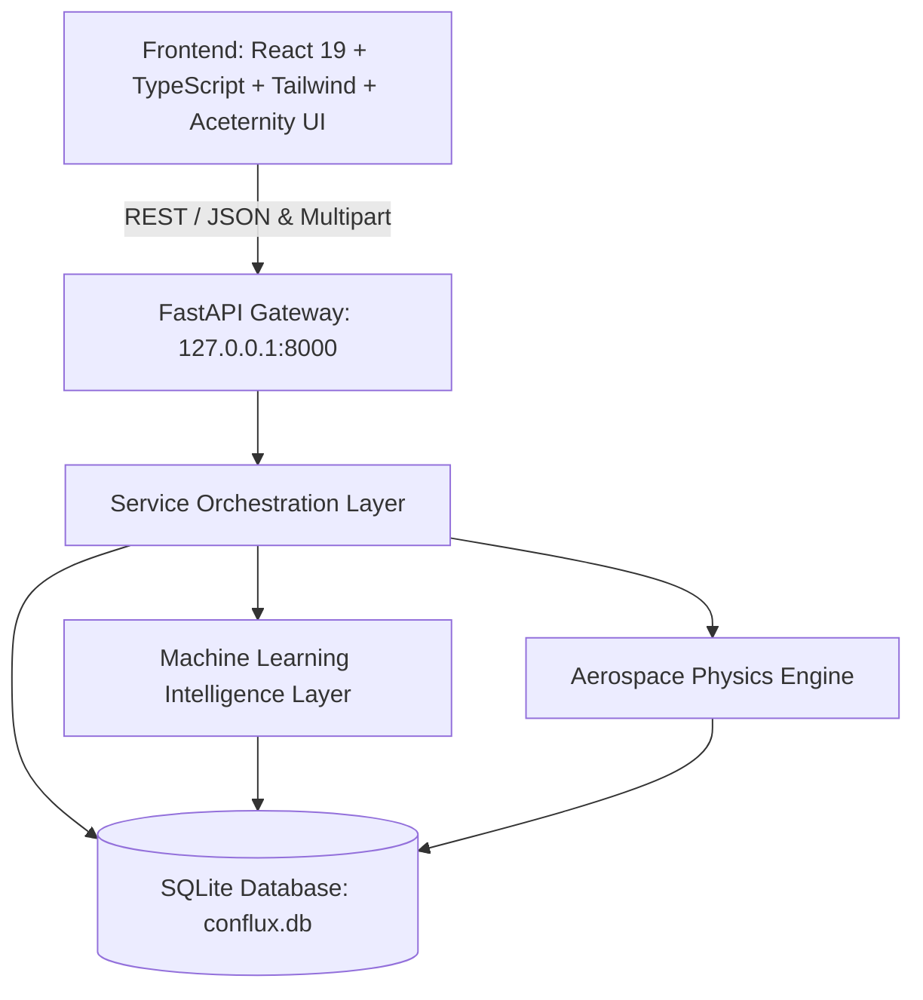

# CONFLUX System Architecture

CONFLUX (**Continuous Multimodal Mission Intelligence Platform**) is a mission-critical aerospace decision-support and telemetry synthesis system. It unifies spacecraft subsystem sensor streams, optical wavefront dynamics, radiometric infrared imagery, orbital relative motion conjunctions, and heliospheric space-weather disturbances.

---

## 1. High-Level Architecture

---

## 2. Component Layers

### 2.1 Frontend Presentation Layer (`/frontend`)
- **Framework**: React 19, TypeScript, Vite, Tailwind CSS v4.
- **Design System**: Dark aerospace console with high-contrast light mode toggle.
- **Components**:
  - `BentoGrid`: Multimodal overview matrix with responsive cards.
  - `CardSpotlight`: Dynamic focus cards with nominal, warning, and critical alert gradients.
  - `Globe` (Aceternity 3D Globe): WebGL interactive planetary mesh visualizing ground station downlinks and spaceports.
  - `TextHoverEffect`: SVG-masked aerospace typography.
  - `Sidebar`: Collapsible navigation drawer tracking live subsystem anomaly status.
- **Subsystem Views**:
  - `Dashboard`: High-level mission health ticker, 3D Globe, and multimodal consensus summary.
  - `Missions`: Spacecraft mission registration, context selection, and database history.
  - `Telemetry`: Subsystem power, pressure, temperature, and vibration analysis.
  - `Thermal`: Radiometric infrared image upload and hotspot detection.
  - `Wavefront`: Zernike aberration decomposition and wavelet energy assessment.
  - `Orbital`: 3D state vector conjunction assessment and collision miss-distance evaluation.
  - `Space Weather`: Solar irradiance, ionizing radiation, and geomagnetic Kp-index disturbances.
  - `Fusion`: 5-modality cross-synthesis and consensus engine.

---

### 2.2 API Gateway Layer (`backend/api/`)
- **FastAPI Endpoints**:
  - `GET /`: Health & system status (`{"system": "CONFLUX", "status": "online"}`).
  - `GET /health`: Gateway heartbeat (`{"status": "healthy"}`).
  - `GET /missions/` & `POST /missions/` (and alias `/mission/`): Mission CRUD and retrieval.
  - `GET /missions/{id}/observations`: Historical modality sensor records.
  - `GET /missions/{id}/anomalies`: Flagged anomaly events.
  - `GET /missions/{id}/fusion`: Synthesized multimodal consensus events.
  - `POST /telemetry/`: Subsystem anomaly isolation evaluation.
  - `POST /imagery/` (and alias `/thermal/`): Radiometric frame analysis via OpenCV.
  - `POST /wavefront/`: Optical Zernike & wavelet anomaly analysis.
  - `POST /orbital/`: Orbital relative motion and conjunction risk.
  - `POST /space-weather/` (and alias `/weather/`): Heliospheric environmental disturbances.
  - `POST /fusion/`: Cross-modal consensus engine.

---

### 2.3 Service Layer (`backend/services/`)
- **`MissionService`**: Manages mission lifecycles, active context switching, and relational record aggregation.
- **`TelemetryService`**: Normalizes feature vectors and executes Isolation Forest predictions.
- **`ImageryService`**: Decodes image payloads and computes intensity standard deviation and hotspot ratios.
- **`OrbitalService`**: Translates 3D coordinates and computes closest-approach physics and risk classifications.
- **`SpaceWeatherService`**: Classifies solar flares, radiation storms, and geomagnetic disturbances.
- **`FusionService`**: Executes cross-modal consensus logic across all 5 operational pipelines.
- **`IntelligenceService`**: Centralized orchestration facade.
- **`CopilotService`**: Contextual mission operator advisory generator.

---

### 2.4 Database & Persistence Layer (`backend/database/`)
- **Engine**: SQLite with SQLAlchemy ORM (`data/conflux.db`).
- **Tables**:
  - `missions`: Registered spacecraft missions (ID, name, spacecraft, status, created_at).
  - `observations`: Multi-channel telemetry and physics observations.
  - `anomaly_events`: Flagged anomaly events with severity and description.
  - `fusion_events`: Multimodal agreement and consensus states.
